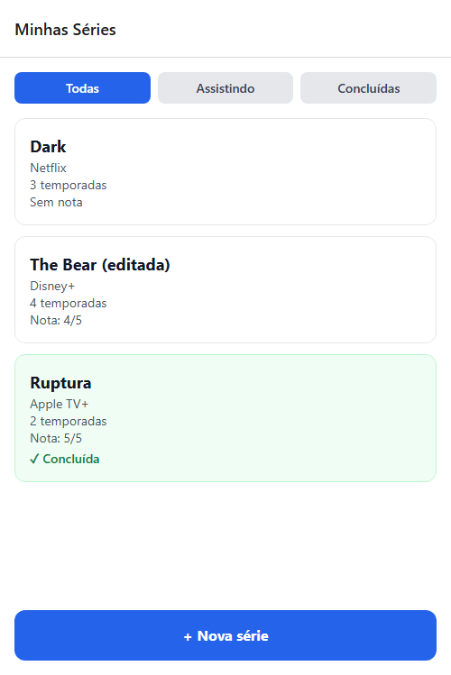
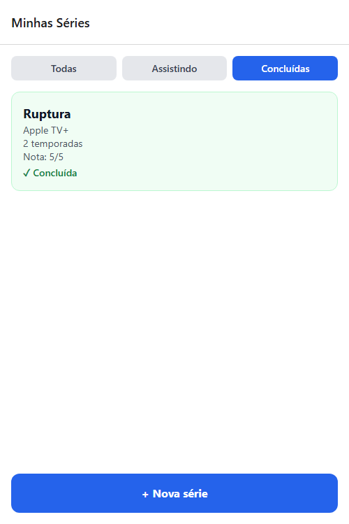

# Minhas Séries

Aplicativo mobile feito com React Native, Expo Router, NativeWind, TypeScript e SQLite para registrar séries em andamento ou concluídas. É possível cadastrar, editar, avaliar de 1 a 5 estrelas, alterar o status, excluir e filtrar a lista. Os dados ficam salvos localmente no aparelho.

## Como rodar

Requisitos: Node.js e o aplicativo Expo Go ou um emulador Android/iOS.

```bash
npm install
npx expo start
```

Depois, leia o QR Code com o Expo Go ou escolha uma das opções exibidas no terminal para abrir em um emulador.

## Teste de persistência

O teste foi realizado com este fluxo:

1. Cadastrei `Ruptura`, `The Bear` e `Dark`.
2. Marquei `Ruptura` como concluída.
3. Editei `The Bear`, alterando o título exibido e o total para 4 temporadas.
4. Fechei completamente o navegador usado no teste e abri o app de novo com o mesmo armazenamento local.
5. Confirmei que as três séries, a edição, as notas e o status continuavam salvos.
6. Ativei o filtro de concluídas e confirmei que apenas `Ruptura` foi exibida.

### Estado preparado antes de fechar


### Dados preservados após reabrir



### Filtro de concluídas após reabrir



## Diário do copiloto

### Registro 1 — Etapa 1

**O que eu pedi:** ajuda para conferir a configuração do Expo Router com NativeWind.

**O que a IA sugeriu (resumo):** usar o Router como entrada do projeto e importar o `global.css` como primeira linha do layout.

**O que eu fiz:** aceitei a orientação e conferi a tela inicial antes de continuar.

### Registro 2 — Etapa 2

**O que eu pedi:** revisão dos tipos necessários para representar uma série.

**O que a IA sugeriu (resumo):** manter `nota` como `number | null`, `concluida` como número e separar os tipos de criação e edição da entidade completa.

**O que eu fiz:** aceitei porque corresponde ao formato salvo pelo SQLite e faz o TypeScript exigir o tratamento da ausência de nota.

### Registro 3 — Etapa 4

**O que eu pedi:** como aplicar os filtros sem trazer todas as linhas para o JavaScript.

**O que a IA sugeriu (resumo):** escolher a consulta conforme o filtro e usar `WHERE concluida = ?`, passando 0 ou 1 como parâmetro.

**O que eu fiz:** adaptei a sugestão para manter todos os valores variáveis nos placeholders e a ordenação por `createdAt` no SQL.

### Registro 4 — Etapa 5

**O que eu pedi:** por que a lista não deveria usar somente `useEffect` ao voltar do formulário.

**O que a IA sugeriu (resumo):** usar `useFocusEffect` com uma função memorizada por `useCallback`, pois a tela anterior continua montada na pilha.

**O que eu fiz:** aceitei e deixei o filtro como dependência do carregamento para a lista atualizar ao voltar e ao trocar o filtro.

### Registro 5 — Etapa 6

**O que eu pedi:** revisão do mesmo formulário para cadastro e edição.

**O que a IA sugeriu (resumo):** ler o parâmetro com `useLocalSearchParams`, converter o `id` com `Number`, carregar os dados na edição e validar o texto de temporadas antes de salvar.

**O que eu fiz:** aceitei e também exigi um número inteiro maior ou igual a zero, evitando salvar texto vazio ou `NaN`.

### Registro 6 — Etapa 7

**O que eu pedi:** como manter o detalhe atualizado depois de voltar da edição.

**O que a IA sugeriu (resumo):** recarregar a série com `useFocusEffect` e chamar apenas as funções do repositório nas três ações da tela.

**O que eu fiz:** aceitei; a tela trata também ID inválido, série ausente e falhas nas operações.

### Registro 7 — Etapa 8 (sugestão corrigida)

**O que eu pedi:** ajuda para testar o fluxo completo e a persistência no build web.

**O que a IA sugeriu (resumo):** inicialmente manteve `openDatabaseSync` e iniciou a migração sem bloquear a montagem da lista.

**O que eu fiz:** corrigi a sugestão depois que o teste real encontrou timeout no worker do SQLite. Troquei para `openDatabaseAsync`, mantive uma única promessa de conexão e só montei as rotas depois da migração. Em seguida repeti o teste, fechei e reabri o app e confirmei a persistência mostrada nos prints.
